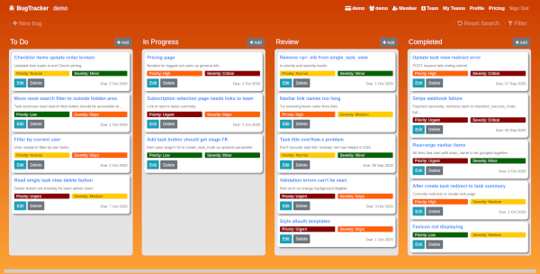
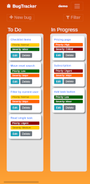

# BugTracker

## Full Stack Frameworks with Django Milestone Project
A live demo of this project can be viewed [here](https://tgc07-project04.herokuapp.com/).
The sample user log in details below can be used to demo the project:
| Username | Password |
|----------|----------|
| test | pass123word |
| bounty_hunter | pass123word |

This web app has been designed as a tool for users to collaborate in teams to log and track the progress of software bugs. Team admin users are able to perform higher access level features relating to the respective team vs limited users. It is possible for a user to be an admin user of some teams and a limited user of other teams. If a user is not a member of a team, they are unable to access that team's information. Subscription payments can be made by any team members, regardless of whether they have admin or limited access, but only admin users can view the team's purchase transaction history.




## UX

### Strategy - User Stories
Users' goals:
- Create or join teams to keep track of the progress of reported software bugs
- Log new software bug reports
- Assign bug report tasks to themselves or leave it unassigned for admin user to assign later
- Edit existing bug reports
- Delete bug reports created by themselves
- Update the progress of a reported bug by dragging from one stage and dropping into another stage (desktop only)
- Make subscription payments
- Filter tasks by search terms, priority, severity and assignee

Team admin users' goals:
- Assign bug report tasks to any team members
- Delete team's bug reports
- View all team members
- Add/remove team members
- Toggle admin status of team members
- View team's past purchase transactions
- Edit team name
- Delete team

Site owners' goals:
- Earn subscription income
- Disable access to a team's bug reports if team's subscription has lapsed
- Use the web app themselves to track their own software bugs

### Scope
Content requirements:
- text
- icons

Functional specification:
- drag and drop tasks
- filter tasks by search terms, priority, severity and assignee

### Structure
#### Interaction Design
- Drag and drop bug reports in order to update its progress status
- Flash messages when additional stage change information needs to be passed to user

#### Interaction Architecture
- Kanban style view of team's bug reports

### Skeleton
Wireframes for the tasks summary page can be viewed [here](report/wireframes).

### Surface
- Typography should be simple and functional for legibility and not distract the user
- Colour scheme of orange and yellow was chosen to give a lively look to the website:


## Features

### Current Features
Users are able to:
- Create or join teams to keep track of the progress of reported software bugs
- Log new software bug reports
- Assign bug report tasks to themselves or leave it unassigned for admin user to assign later
- Edit existing bug reports
- Delete bug reports created by themselves
- Update the progress of a reported bug by dragging from one stage and dropping into another stage (desktop only)
- Make subscription payments
- Filter tasks by search terms, priority, severity and assignee

In addition to above features, team admins are able to:
- Assign bug report tasks to any team members
- Delete team's bug reports
- View all team members
- Add/remove team members
- Toggle admin status of team members
- View team's past purchase transactions
- Edit team name
- Delete team

### Features Left to Implement
- Remember order of tasks within each stage by storing in database
- Use UUID for user IDs and team IDs for better security
- Enable team admins to create their own progress stages for each team with ability to have a variable number of progress stages
- Enable team admins to create custom priority and severity levels for their team's bug reports
- Implement a better database on_delete policy
- Dashboard for admin users for to provide such as number of tasks assigned to each team member, time taken to fix bugs, etc

## Technologies Used
- Python
- HTML
- CSS
- JavaScript
- [Django 3.1.1](https://www.djangoproject.com/)
- [django-allauth](https://django-allauth.readthedocs.io/en/latest/overview.html) for user authentication
- [django-crispy-forms](https://django-crispy-forms.readthedocs.io/en/latest/) for form styling
- [django-mathfilters](https://pypi.org/project/django-mathfilters/) for template calculations
- [djangorestframework](https://www.django-rest-framework.org/) to build RESTful APIs
- [dotenv](https://pypi.org/project/python-dotenv/) to use environment variables
- [PostgreSQL](https://www.postgresql.org/) as the database
- [psycopg2](https://pypi.org/project/psycopg2/) as the PostgreSQL database adapter for Python
- [dj-database-url](https://pypi.org/project/dj-database-url/) to use DATABASE_URL environment variable to configure Django application
- [Heroku](https://www.heroku.com/) to host the web app
- [gunicorn 20.0.4](https://gunicorn.org/) as the Python WSGI HTTP Server for deployment
- [WhiteNoise](http://whitenoise.evans.io/en/stable/) to simply static file serving
- [Stripe](https://stripe.com/) to handle payments
- [JQuery](https://jquery.com/) for DOM manipulation
- [toastr](https://codeseven.github.io/toastr/) for flash messaging
- [Bootstrap 4.5](https://getbootstrap.com/docs/4.5/getting-started/introduction/) for web page styling
- [Font Awesome 4.7.0](https://fontawesome.com/v4.7.0/) for icons
- [GitHub](https://github.com/) for source control

## Programming Methodologies
- Data driven approach to generating the team's tasks summary view
- RESTful API to update tasks and create/read/update/delete checklist items
- AJAX calls triggered when tasks are dragged from one progress stage and dropped in a different stage, and CRUD for checklist items
- .env file used to store environment variables so that secret keys are not publicly viewable
- git and GitHub for source control

## Database Design
- The ER diagram for this project's database can be viewed [here](report/database/entity-relationship-diagram.png)
- The database schema for this project's database can be viewed [here](report/database/database-schema.png)

## Testing
- A Test Driven Development (TDD) approach was taken when building the web app.
- For automated testing, TestCase classes were created in each Django app, each with their own methods to test different CRUD operations.
- In addition, the following manual tests were performed:

|  # | Event | Expected Outcome | Actual Outcome |
|----|-------|------------------|----------------|
| As logged out user |
|  1 | Try to access restricted content via URL | Redirected to login page | As expected |
| As logged in user with limited user membership rights to team |
|  2 | Add/update task | Should only see own self in list of assignees (admin access rights needed to list all team members) | As expected |
|  3 | View tasks summary page | Delete task buttons only displayed on tasks created by own self | As expected |
|  4 | Drag task from one stage to another | Task's stage has been updated | As expected |
|  5 | Filter tasks by text input field and/or priority level and/or severity level and/or assignee | Return tasks matching query | As expected |
|  6 | Create, update, delete checklist item | New checklist item is created via AJAX call | As expected |
|  7 | Check/uncheck checklist item's checkbox | Progress bar is updated via AJAX call | As expected |
|  8 | Try to access admin only content via URL | Redirected and flash message displayed saying user does not have necessary access rights | As expected |
|  9 | Purchase team subscription | Payment via Stripe and redirected back to team's tasks summary view | As expected |
| 10 | Try to access team's tasks summary view for a team whose subscription has lapsed | Redirected to select subscription page | As expected |
| 11 | Create/update team with same name as an existing team in database | Submit form is rejected and error message displayed | As expected |
| 12 | Create/update team with incorrect regex requirements | Submit form is rejected and error message displayed | As expected |
| As team admin |
| 13 | Try to remove admin rights of last remaining admin user on team | Rejected and error message displayed | As expected |
| 14 | Try to delete membership of last remaining admin user on team | Rejected and error message displayed | As expected |
| 15 | View team's tasks summary page | Delete buttons are displayed for all tasks | As expected |
| 16 | View team's purchase transaction history | Displays (only for team admin users) | As expected |
| 17 | View team's members | Displays (only for team admin users) | As expected |
| 18 | Add/update task | Able to select from all team members for assignees | As expected |

## Deployment
A live demo of this project can be viewed [here](https://tgc07-project04.herokuapp.com/).
All the source code for this project is available [here](https://github.com/andrewsui/tgc07-project04) on GitHub.

Code for the project was committed to GitHub in the following manner:
- Individual files were added to the next commit staging area by executing the `git add <filename>` command in a command-line interface.
- All changes in the working directory were added to the next commit staging area by executing the `git add .` command in a command-line interface.
- Staged content was committed as new commit snapshot by executing the `git commit -m “<message>"` command in a command-line interface.
- Local branch commits were pushed to the remote repository master branch by executing the `git push -u origin master` command in a command-line interface.
- Subsequent local branch commits were pushed to the remote repository master branch by executing the `git push` command in a command-line interface.

Deployment to Heroku was performed in a debian based Linux environment bash terminal in the following manner:
- Install Heroku on local machine `sudo snap install heroku --classic`
- Log into Heroku `heroku login -i`
- Create a new heroku app `heroku create <app-name>`
- Verify that the correct remotes have been added `git remote -v`
- If changing PC, add heroku remote by executing `heroku git:remote -a <heroku app name>`
- Setup a Python virtual environment in the root folder of the project `python3 -m venv venv`
- Activate the Python virtual environment whilst being in the root folder of the project `source venv/bin/activate`
- Install `libpq-dev` `python3-dev` packages **before** installing `psycopg2` Python pip library `sudo apt install libpq-dev python3-dev`
- Install the dependencies `pip install dj-database-url Django django-allauth django-crispy-forms django-mathfilters djangorestframework gunicorn psycopg2 python-dotenv stripe whitenoise`
- Create `requirements.txt` file in the root of the project folder to record dependencies for deployment and reinstallation on other machines `pip freeze > requirements.txt`
- Create `runtime.txt` file in the root of the project folder to specify which version of Python Heroku will use. Make sure to choose from [Heroku's supported list](https://devcenter.heroku.com/articles/python-support#specifying-a-python-version) of Python versions. In may case, I used `python-3.8.6`.

Using a file manager:
- Create a file named `Procfile` without speech-marks or file extension and save `web gunicorn <Django app name without .py>.wsgi:application` on the first line of `Procfile` (in my case, the content of the Procfile was `web: gunicorn app_main.wsgi:application`)

Using a web browser:
- Log into [Heroku](https://id.heroku.com/login) and set environment variables for
```
SECRET_KEY = "<your own key>"
DEBUG_MODE = "False"
DATABASE_URL = "<Heroku PostgreSQL database URL>"
STRIPE_PUBLISHABLE_KEY = "<Stripe publishable key>"
STRIPE_SECRET_KEY = "<Stripe secret key>"
STRIPE_WEBHOOK_SIGNING_SECRET = "<Stripe webhook endpoint signing secret>"
EMAIL_HOST_PASSWORD = "<email host password>"
EMAIL_HOST_USER = "<email address>"
```

Back in the bash terminal:
- Commit all new changes to GitHub `git add .` then `git commit -m “<message>"` then `git push`
- Finally, push to Heroku `git push heroku master`

## Run locally on your own machine on debian based Linux OS
1. Clone the [repository](https://github.com/andrewsui/tgc07-project04)
2. Setup a Python virtual environment in the root folder of the project `python3 -m venv venv`
3. Activate the Python virtual environment whilst in the root folder of the project `source venv/bin/activate`
4. Install `libpq-dev` `python3-dev` packages **before** installing `psycopg2` Python pip library `sudo apt install libpq-dev python3-dev` (Note: `dj-database-url` `gunicorn` `psycopg2` `whitenoise` Python pip libraries are only needed for Heroku deployment, so you may choose to skip this Step 4 and remove the respective Python pip libraries from the requirements.txt dependencies file.)
5. Install the dependencies `pip install -r requirements.txt`
6. Setup and run a public URL for testing using a service such as [ngrok](https://ngrok.com/) and your chosen <port_number>. Note down this public URL for use in step below referenced as <ngrok_URL>. This is required for Stripe webhook redirects.
7. Setup a Stripe webhook endpoint for `checkout.session.completed` from the "events to send" drop-down list
8. In root folder of project, create a `.env` file and set the following environment variables
```
export SECRET_KEY = "<your own key>"
export DEBUG_MODE = "True"
export DEBUG_URL = "<ngrok_URL>"
export STRIPE_PUBLISHABLE_KEY = "<Stripe publishable key>"
export STRIPE_SECRET_KEY = "<Stripe secret key>"
export STRIPE_WEBHOOK_DEBUG = "<Stripe webhook endpoint signing secret>"
```
9. Make database migrations `python manage.py makemigrations`
10. Migrate `python manage.py migrate`
11. Create superuser `python manage.py createsuperuser`
12. Run the web app `python manage.py runserver <port_number>`
13. Use a web browser to navigate to `<ngrok_URL>:<port_number>`

## Credits and acknowledgements
- [WebDevSimplified](https://github.com/WebDevSimplified/Drag-And-Drop) for code to enable drag and drop feature
- [Font Awesome 4.7.0](https://fontawesome.com/v4.7.0/) for icons
- [favicon.io](https://favicon.io/emoji-favicons/mosquito/) for favicon
- [Toptal](https://www.toptal.com/developers/gitignore/api/django) for .gitignore template
